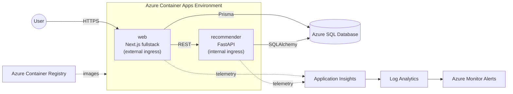

# Cloud E-Commerce

A full-stack e-commerce platform with a product recommendation service, built and deployed entirely on Microsoft Azure.

> Status: **project skeleton** — folder structure and base tooling only. Features are not implemented yet.

## Architecture



- **web** — storefront, admin dashboard and backend API (Next.js Route Handlers). The only public entry point.
- **recommender** — generates product recommendations from user behavior. Only reachable from inside the Container Apps environment.
- **Azure SQL Database** — single shared database for both services.

## Tech stack

| Area | Technology |
|---|---|
| Web (fullstack) | Next.js 16 (App Router), React 19, TypeScript, Tailwind CSS 4 |
| ORM | Prisma 7 with `@prisma/adapter-mssql` |
| Recommender | Python, FastAPI, SQLAlchemy, pandas, scikit-learn |
| Database | Azure SQL Database (SQL Server, serverless tier) |
| Hosting | Azure Container Apps, Azure Container Registry |
| Monitoring | Application Insights, Log Analytics, Azure Monitor Alerts |
| Infrastructure as Code | Bicep |
| CI/CD | GitHub Actions |

## Project structure

```
cloud-e-commerce/
├── apps/
│   ├── web/                    # Next.js fullstack app
│   │   ├── prisma/             # schema.prisma, migrations
│   │   └── src/
│   │       ├── app/
│   │       │   ├── (shop)/     # customer pages: home, products, cart, checkout
│   │       │   ├── (admin)/    # admin pages
│   │       │   └── api/        # Route Handlers (backend API)
│   │       ├── components/
│   │       │   ├── ui/         # reusable UI components
│   │       │   └── layout/     # header, footer, sidebar
│   │       ├── hooks/
│   │       ├── lib/            # prisma client, auth, recommender client
│   │       └── types/
│   └── recommender/            # FastAPI recommendation service
│       ├── app/
│       │   ├── api/            # routers
│       │   ├── core/           # config, logging, telemetry
│       │   ├── db/             # database session
│       │   ├── schemas/        # Pydantic models
│       │   ├── services/       # business logic
│       │   └── ml/             # recommendation algorithms / trained models
│       ├── notebooks/          # data exploration, model experiments
│       └── tests/
├── infra/                      # Azure infrastructure (Bicep)
│   ├── modules/
│   └── parameters/
├── .github/workflows/          # CI/CD pipelines
├── docs/
│   ├── architecture/           # diagrams, design decisions
│   └── report/                 # project report
└── scripts/                    # helper scripts (seed data, deploy)
```

## Prerequisites

- Node.js 22+
- Python 3.11+
- Docker Desktop
- Azure CLI (with Bicep)
- An Azure subscription

## Getting started

### Web

```bash
cd apps/web
npm install              # also runs `prisma generate`
# set DATABASE_URL in .env (created by `prisma init`)
npm run db:migrate       # apply Prisma migrations
npm run dev              # http://localhost:3000
```

Available scripts:

| Script | Description |
|---|---|
| `npm run dev` | Start dev server |
| `npm run build` | Production build |
| `npm run lint` | Run ESLint |
| `npm run db:migrate` | Create/apply migrations in development |
| `npm run db:deploy` | Apply migrations in production |
| `npm run db:studio` | Open Prisma Studio |

### Recommender

_To be added once the service is implemented._

## Deployment

_To be added once `infra/` and `.github/workflows/` are implemented._

## Git workflow

- Never commit directly to `main`; work on feature branches and open a pull request.
- Branch names: `feat/<name>`, `fix/<name>`, `chore/<name>`.
- Commit messages follow [Conventional Commits](https://www.conventionalcommits.org/): `feat:`, `fix:`, `chore:`, `refactor:`, `docs:`.
